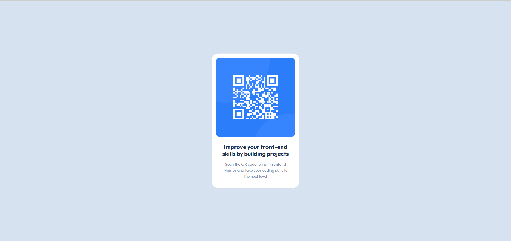
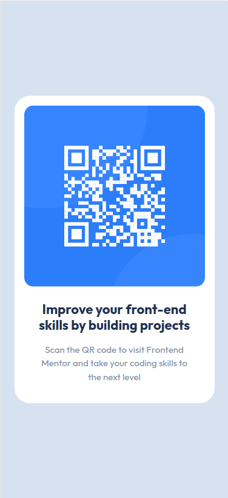

# Frontend Mentor - QR code component solution

This is a solution to the [QR code component challenge on Frontend Mentor](https://www.frontendmentor.io/challenges/qr-code-component-iux_sIO_H). Frontend Mentor challenges help you improve your coding skills by building realistic projects. 

## Table of contents

- [Overview](#overview)
  - [Screenshot](#screenshot)
  - [Links](#links)
- [My process](#my-process)
  - [Built with](#built-with)
  - [Continued development](#continued-development)
  - [Useful resources](#useful-resources)
- [Author](#author)

## Overview

I have used HTML, CSS & Bootstrap 5 CSS library to achieve this challenge.

### Screenshot

Desktop Screenshot :

Mobile Screenshot :

### Links

- Live Site URL: [Click Here](https://keerankb.github.io/qr-code-frontend-mentor/)

## My process

### Built with

- Semantic HTML5 markup
- CSS custom properties
- Bootstrap 5
- CSS Grid

### Continued development

Looking forward to cover this challenge or upcoming challenge in future with some trending front end frameworks in the market.

### Useful resources

- [Bootstrap 5](https://getbootstrap.com/) - This CSS library helped me to design various things for this page.

## Author

- Frontend Mentor - [@keerankb](https://www.frontendmentor.io/profile/keerankb)
- LinkedIn - [@kiran-bhadre-kb](https://www.linkedin.com/in/kiran-bhadre-kb)
- Github  - [@keerankb](https://github.com/keerankb)
